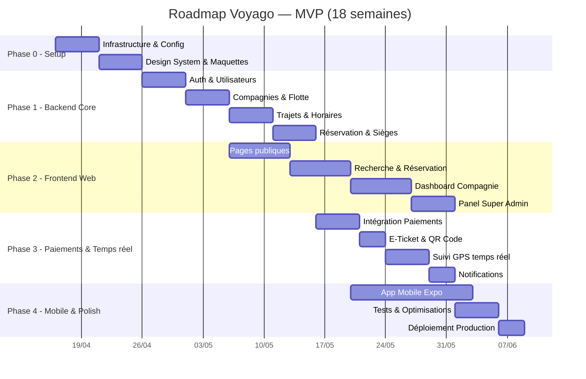
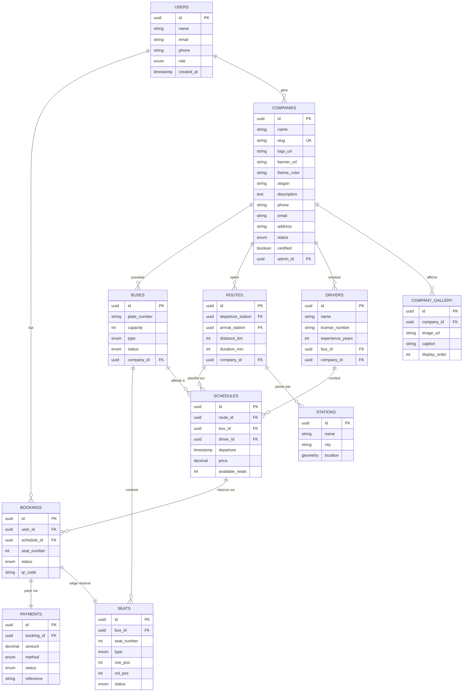

# 🗺️ Roadmap Voyago — Plateforme de Transport Routier au Togo

> **Durée totale estimée** : 18 semaines (MVP) · **Stack** : Next.js 16 + Node.js/TS + PostgreSQL/PostGIS + Expo

---

## Vue d'ensemble des phases

---

## État au 2026-04-26

- Le dépôt est actuellement stable sur les vérifications locales principales :
- `web` : build et lint validés
- `api` : build et tests validés
- `mobile` : vérification TypeScript validée
- La feuille de route ci-dessous reste la cible produit, mais une partie du travail récent a porté sur la stabilisation technique, la correction de l'orthographe et l'alignement des tests.

---

## Phase 0 — Infrastructure & Design (Semaine 1-2)

> **Objectif** : Poser les fondations solides du projet.

### Semaine 1 : Setup technique

| # | Tâche | Détails | Priorité |
|---|-------|---------|----------|
| 0.1 | Initialiser le monorepo | Structure `web/`, `api/`, `mobile/`, `docs/` | 🔴 Critique |
| 0.2 | Setup Next.js (web) | App Router, TypeScript, configuration ESLint/Prettier | 🔴 Critique |
| 0.3 | Setup API Node.js/Express | TypeScript, structure MVC, middleware de base | 🔴 Critique |
| 0.4 | Setup PostgreSQL + PostGIS | Schéma initial, connexion Supabase, migrations | 🔴 Critique |
| 0.5 | CI/CD | GitHub Actions (lint, tests, build) | 🟡 Important |
| 0.6 | Variables d'environnement | `.env.example`, configuration par environnement | 🔴 Critique |

**Livrables** : Monorepo fonctionnel, `npm run dev` opérationnel sur web + api.

### Semaine 2 : Design System & Maquettes

| # | Tâche | Détails | Priorité |
|---|-------|---------|----------|
| 0.7 | Identité visuelle | Logo, palette de couleurs, typographie | 🔴 Critique |
| 0.8 | Design System CSS | Tokens (couleurs, spacing, shadows), composants de base | 🔴 Critique |
| 0.9 | Maquettes UI (Figma) | Écrans principaux : Accueil, Recherche, Réservation, Dashboard | 🟡 Important |
| 0.10 | Composants UI réutilisables | Button, Input, Card, Modal, Badge, Select | 🔴 Critique |
| 0.11 | Layout responsive | Header, Sidebar, Footer, Mobile Navigation | 🔴 Critique |

**Livrables** : Design system complet, composants UI prêts, layouts responsive.

---

## Phase 1 — Backend Core (Semaine 3-6)

> **Objectif** : Construire toute la logique métier côté serveur.

### Semaine 3 : Authentification & Utilisateurs

| # | Tâche | Détails | Priorité |
|---|-------|---------|----------|
| 1.1 | Modèle `users` | Table PostgreSQL (id, nom, email, phone, role, avatar, created_at) | 🔴 Critique |
| 1.2 | Inscription / Connexion | JWT, hash bcrypt, validation Zod | 🔴 Critique |
| 1.3 | Rôles & permissions | `passenger`, `company_admin`, `driver`, `super_admin` | 🔴 Critique |
| 1.4 | Middleware auth | Vérification JWT, extraction du rôle, guard par route | 🔴 Critique |
| 1.5 | Profil utilisateur | CRUD profil, upload avatar, changement mot de passe | 🟡 Important |
| 1.6 | Validation téléphone Togo | Format +228, préfixes T-Money (90/91/92/93) et Flooz (96/97/98/99) | 🟡 Important |

**Livrables** : API Auth complète avec JWT, rôles isolés, validation stricte.

### Semaine 4 : Compagnies, Vitrine & Gestion de Flotte

| # | Tâche | Détails | Priorité |
|---|-------|---------|----------|
| 1.7 | Modèle `companies` (enrichi) | nom, **slug** (URL unique), logo, **bannière**, **couleur_theme**, description, **slogan**, contact, phone, email, adresse, statut (pending/active/suspended), certifiée | 🔴 Critique |
| 1.8 | Modèle `company_gallery` | company_id, image_url, caption, ordre d'affichage | 🟡 Important |
| 1.9 | Modèle `buses` | immatriculation, capacité, type (standard/VIP/climatisé), statut, **photos**, company_id | 🔴 Critique |
| 1.10 | Modèle `drivers` | permis, expérience, affectation bus, company_id | 🟡 Important |
| 1.11 | CRUD Compagnies | Création, validation admin, mise à jour, suspension | 🔴 Critique |
| 1.12 | **API Vitrine Compagnie** | Upload logo/bannière/galerie (Supabase Storage), màj slug, couleur thème, description | 🔴 Critique |
| 1.13 | **API Page Publique** | `GET /companies/:slug` — retourne toutes les infos publiques + trajets + avis | 🔴 Critique |
| 1.14 | CRUD Bus | Ajout/modification/suppression, plan de sièges configurable | 🔴 Critique |
| 1.15 | CRUD Chauffeurs | Profil, documents, affectation à un bus/trajet | 🟡 Important |

**Livrables** : API complète de gestion de flotte + système de vitrine personnalisable avec upload d'images.

### Semaine 5 : Trajets & Horaires

| # | Tâche | Détails | Priorité |
|---|-------|---------|----------|
| 1.16 | Modèle `stations` | nom, ville, coordonnées GPS (PostGIS POINT), adresse | 🔴 Critique |
| 1.17 | Modèle `routes` | station_départ, station_arrivée, distance_km, durée_estimée, company_id | 🔴 Critique |
| 1.18 | Modèle `schedules` | route_id, bus_id, driver_id, date_départ, heure, prix, places_dispo | 🔴 Critique |
| 1.19 | Recherche de trajets | Filtres : ville départ/arrivée, date, heure, prix, compagnie | 🔴 Critique |
| 1.20 | Requêtes géo-spatiales | PostGIS : stations proches, calcul distances | 🟡 Important |
| 1.21 | Escales intermédiaires | Support des trajets multi-arrêts (Lomé → Atakpamé → Sokodé → Kara) | 🟢 Nice-to-have |

**Livrables** : Système de trajets complet avec recherche géo-spatiale.

### Semaine 6 : Réservation & Sièges

| # | Tâche | Détails | Priorité |
|---|-------|---------|----------|
| 1.22 | Modèle `bookings` | user_id, schedule_id, seat_number, statut, prix, payment_id | 🔴 Critique |
| 1.23 | Modèle `seats` | bus_id, numéro, type (standard/VIP), position (row, col), statut | 🔴 Critique |
| 1.24 | Logique de réservation | Vérification dispo, verrouillage temporaire (10min), confirmation | 🔴 Critique |
| 1.25 | Annulation & remboursement | Politique d'annulation (24h avant, 50% remboursé) | 🟡 Important |
| 1.26 | Historique des réservations | Liste paginée avec filtres pour passager et compagnie | 🟡 Important |

**Livrables** : Système de réservation avec gestion des conflits et verrouillage.

---

## Phase 2 — Frontend Web (Semaine 5-10)

> **Objectif** : Construire les interfaces web pour les 3 types d'utilisateurs.
> ⚠️ Cette phase démarre en parallèle de la Phase 1 dès que les APIs de base sont prêtes.

### Semaine 5-6 : Pages Publiques

| # | Tâche | Détails | Priorité |
|---|-------|---------|----------|
| 2.1 | Page d'accueil | Hero section, recherche rapide, **carrousel compagnies partenaires**, CTA | 🔴 Critique |
| 2.2 | Page de recherche | Formulaire (départ, arrivée, date), résultats triables, filtres | 🔴 Critique |
| 2.3 | Page Login / Inscription | Formulaire avec validation, lien mot de passe oublié | 🔴 Critique |
| 2.4 | **Page Catalogue Compagnies** | `/compagnies` — Grille de toutes les compagnies avec logo, nom, note, badge certifié | 🔴 Critique |
| 2.5 | **🏪 Page Vitrine Compagnie** | `/compagnies/[slug]` — Page publique personnalisée : bannière, logo, couleur thème, description, galerie photos, trajets disponibles, avis clients, infos contact | 🔴 Critique |
| 2.6 | Page "À propos" | Présentation, équipe, mission | 🟢 Nice-to-have |
| 2.7 | Page FAQ / Contact | Questions fréquentes, formulaire de contact | 🟢 Nice-to-have |
| 2.8 | SEO & Meta tags | Titres, descriptions, Open Graph **dynamique par compagnie** | 🟡 Important |

### Semaine 7-8 : Recherche & Réservation

| # | Tâche | Détails | Priorité |
|---|-------|---------|----------|
| 2.9 | Résultats de recherche | Cards de trajets (heure, prix, compagnie, places dispo) | 🔴 Critique |
| 2.10 | Page détail trajet | Infos complètes, avis, sélection de siège | 🔴 Critique |
| 2.11 | Plan de sièges interactif | Grille visuelle, sièges cliquables, légende couleur | 🔴 Critique |
| 2.12 | Tunnel de réservation | Étapes : Siège → Infos passager → Paiement → Confirmation | 🔴 Critique |
| 2.13 | Page "Mes réservations" | Liste, statut, détails, annulation | 🟡 Important |
| 2.14 | E-Ticket (PDF + QR) | Génération du ticket avec QR code scannable | 🟡 Important |

### Semaine 9 : Dashboard Compagnie

| # | Tâche | Détails | Priorité |
|---|-------|---------|----------|
| 2.15 | Vue d'ensemble | KPIs : revenus, réservations, taux remplissage, graphiques | 🔴 Critique |
| 2.16 | **🎨 Éditeur de Vitrine** | Interface drag & drop pour personnaliser : logo, bannière, couleur thème, slogan, description, galerie photos, **prévisualisation en direct** | 🔴 Critique |
| 2.17 | Gestion des bus | Table CRUD, statut, caractéristiques, **photos des bus** | 🔴 Critique |
| 2.18 | Gestion des trajets | Calendrier des départs, création/modification | 🔴 Critique |
| 2.19 | Gestion des chauffeurs | Liste, affectation, planning hebdomadaire | 🟡 Important |
| 2.20 | Rapport des ventes | Graphiques (recharts), export PDF/Excel | 🟡 Important |
| 2.21 | Paramètres compagnie | Infos légales, coordonnées bancaires, **gestion du slug URL** | 🟡 Important |

### Semaine 10 : Panel Super Admin

| # | Tâche | Détails | Priorité |
|---|-------|---------|----------|
| 2.22 | Dashboard global | Stats réseau : compagnies, trajets, revenus, utilisateurs | 🔴 Critique |
| 2.23 | Gestion des compagnies | Validation, certification (badge), suspension | 🔴 Critique |
| 2.24 | Gestion des utilisateurs | Liste, rôles, blocage, recherche | 🟡 Important |
| 2.25 | Configuration commissions | Taux par compagnie ou global (2-5%) | 🟡 Important |
| 2.26 | Modération & litiges | Interface de gestion des réclamations | 🟢 Nice-to-have |

---

## Phase 3 — Paiements & Temps Réel (Semaine 8-12)

> **Objectif** : Intégrer les paiements mobile money et le suivi GPS en direct.

### Semaine 8-9 : Paiements Mobile Money

| # | Tâche | Détails | Priorité |
|---|-------|---------|----------|
| 3.1 | Architecture paiement | Pattern Provider/Factory (comme Kelvix Rewards) | 🔴 Critique |
| 3.2 | Intégration GeniusPay | Gateway unifié T-Money + Flooz | 🔴 Critique |
| 3.3 | Webhook de confirmation | Écoute des callbacks de paiement, mise à jour statut booking | 🔴 Critique |
| 3.4 | Modèle `payments` | amount, method, status, reference, booking_id, timestamps | 🔴 Critique |
| 3.5 | Page de paiement | Choix méthode, saisie numéro, confirmation, loader | 🔴 Critique |
| 3.6 | Gestion des échecs | Retry, timeout, remboursement automatique | 🟡 Important |

### Semaine 10 : E-Ticket & QR Code

| # | Tâche | Détails | Priorité |
|---|-------|---------|----------|
| 3.7 | Génération QR Code | Unique par réservation, données chiffrées | 🔴 Critique |
| 3.8 | Template E-Ticket | PDF stylisé (compagnie, trajet, siège, QR, date) | 🔴 Critique |
| 3.9 | Scanner QR (chauffeur) | Page web de scan pour validation à l'embarquement | 🟡 Important |
| 3.10 | Envoi par SMS/Email | Notification avec lien de téléchargement du ticket | 🟡 Important |

### Semaine 11-12 : Suivi GPS & Notifications

| # | Tâche | Détails | Priorité |
|---|-------|---------|----------|
| 3.11 | Setup Socket.io | Serveur WebSocket, rooms par trajet, auth par token | 🔴 Critique |
| 3.12 | Émission position GPS | App chauffeur envoie position toutes les 15s | 🔴 Critique |
| 3.13 | Carte de suivi (Leaflet) | Affichage position bus en temps réel avec itinéraire | 🔴 Critique |
| 3.14 | Fallback polling | Mode dégradé en faible connexion (polling 60s) | 🟡 Important |
| 3.15 | Notifications push | Alerte départ dans 1h, bus en approche, retard | 🟡 Important |
| 3.16 | Historique des positions | Stockage pour analytics et traçabilité | 🟢 Nice-to-have |

---

## Phase 4 — Mobile & Déploiement (Semaine 10-18)

> **Objectif** : Livrer l'application mobile et déployer en production.

### Semaine 10-14 : Application Mobile (Expo)

| # | Tâche | Détails | Priorité |
|---|-------|---------|----------|
| 4.1 | Setup Expo + Router | Configuration, thème, navigation bottom tabs | 🔴 Critique |
| 4.2 | Écran Recherche | Formulaire départ/arrivée avec autocomplétion | 🔴 Critique |
| 4.3 | Écran Résultats | Liste scrollable, filtres, tri | 🔴 Critique |
| 4.4 | Écran Réservation | Sélection siège + paiement | 🔴 Critique |
| 4.5 | Écran Mes Tickets | Liste des réservations avec QR Code | 🔴 Critique |
| 4.6 | Écran Suivi GPS | Carte temps réel avec position du bus | 🟡 Important |
| 4.7 | Notifications push | Expo Notifications setup | 🟡 Important |
| 4.8 | Mode offline | Cache des tickets, consultation hors connexion | 🟡 Important |
| 4.9 | App Chauffeur | Écran dédié : démarrer trajet, scanner QR, émettre GPS | 🟡 Important |

### Semaine 15-16 : Tests & Optimisations

| # | Tâche | Détails | Priorité |
|---|-------|---------|----------|
| 4.10 | Tests unitaires API | Jest, couverture > 80% sur les routes critiques | 🔴 Critique |
| 4.11 | Tests E2E web | Playwright : tunnel réservation, paiement, dashboard | 🟡 Important |
| 4.12 | Tests de charge | Simuler 500+ réservations simultanées | 🟡 Important |
| 4.13 | Audit sécurité | Rate limiting, CORS, injection SQL, XSS, CSRF | 🔴 Critique |
| 4.14 | Optimisation perf | Lazy loading, cache Redis, compression images | 🟡 Important |
| 4.15 | PWA setup | Service worker, manifest, installation prompt | 🟡 Important |
| 4.16 | Accessibilité (a11y) | Contraste, navigation clavier, labels ARIA | 🟢 Nice-to-have |

### Semaine 17-18 : Déploiement Production

| # | Tâche | Détails | Priorité |
|---|-------|---------|----------|
| 4.17 | Déploiement Web | Vercel (Next.js) — domaine voyago.tg | 🔴 Critique |
| 4.18 | Déploiement API | Render / Railway — SSL, monitoring | 🔴 Critique |
| 4.19 | Base de données prod | Supabase Pro — backups automatiques, RLS | 🔴 Critique |
| 4.20 | Redis prod | Upstash Redis — cache & sessions | 🟡 Important |
| 4.21 | Monitoring | Sentry (erreurs), Vercel Analytics (perf) | 🟡 Important |
| 4.22 | Publication mobile | Google Play Store + APK direct | 🟡 Important |
| 4.23 | Onboarding pilote | Formation 1-3 compagnies, import données | 🔴 Critique |

---

## 📊 Résumé des priorités

| Priorité | Signification | Nombre de tâches |
|----------|--------------|-----------------|
| 🔴 **Critique** | Indispensable pour le MVP | ~48 tâches |
| 🟡 **Important** | Nécessaire mais peut être simplifié | ~25 tâches |
| 🟢 **Nice-to-have** | Peut être reporté post-MVP | ~7 tâches |

---

## 📐 Schéma de la Base de Données (Simplifié)

---

## 🎯 Critères de succès du MVP

| Métrique | Objectif |
|----------|----------|
| Compagnies partenaires | 1 à 3 compagnies actives |
| Trajets couverts | Axe Lomé ↔ Kara (+ escales) |
| Réservations / semaine | 50+ après 1 mois |
| Taux de complétion paiement | > 80% |
| Temps de chargement page | < 2 secondes |
| Disponibilité API | > 99% uptime |
| Score sécurité | > 9/10 |
| Bugs critiques | 0 en production |

---

## ⚠️ Risques identifiés & mitigations

| Risque | Impact | Mitigation |
|--------|--------|------------|
| Compagnies réticentes à digitaliser | 🔴 Élevé | Démonstration gratuite, formation, accompagnement |
| Connectivité faible en zone rurale | 🟡 Moyen | PWA offline, fallback SMS pour tickets |
| Fraude sur les paiements | 🔴 Élevé | Webhooks vérifiés, double validation, logs |
| Concurrence future | 🟡 Moyen | First-mover advantage, fidélisation compagnies |
| Scalabilité serveur (GPS temps réel) | 🟡 Moyen | Redis pub/sub, fallback polling, scaling horizontal |

---

> **Prochaine étape recommandée** : Finaliser `0.5 CI/CD`, puis enchaîner sur la migration Supabase et le branchement des parcours métier restants.
